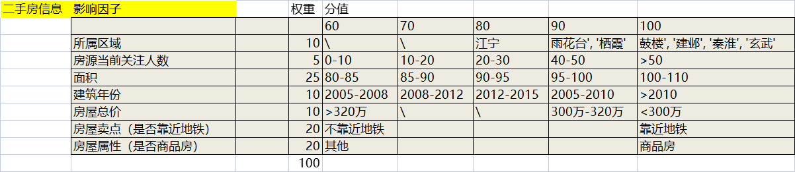

# HousingPriceAnalysePlatform
房价分析平台

## 数据爬取
- 数据来源：链家网
- 数据爬取频率：T+1
## 数据存储
- 存储格式：CSV/Sqlite
## 数据清洗
- 数据集分为两份，一份为全量数据集
- 数据集分为两份，一份为符合筛选条件的数据集
## 数据分析
- 计算每天每个区的平均房价，在售房源数量
- 追踪符合筛选条件的二手房每天价格变化趋势
- 通过权重配置和影响因子配置为符合条件的房源打分排序

## 数据报告
- 基于echars将数据分析结果可视化
- 将可视化结果保存为图片
- 最终将可视化图片和明细数据输出为Excel
## 任务调度
- 每天定时执行任务

